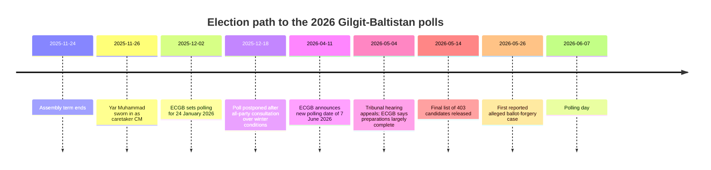

# 2026 Gilgit-Baltistan Elections

## Executive summary

As of 27 May 2026, Gilgit-Baltistan is heading into a **7 June 2026** assembly election after the original **24 January 2026** polling date was postponed because of severe winter conditions. The immediate electoral picture is unusually fragmented: the Election Commission’s final list shows **403 candidates** for **24 general seats**, including **272 independents**, **131 party-backed candidates**, and only **8 women candidates** in the final field. Administrative preparations are formally advanced, but legal appeals, code-of-conduct enforcement, and at least one alleged forgery case indicate that the pre-poll environment is still fluid. citeturn49view0turn39view2turn41view0turn41view1turn39view0

Historically, Gilgit-Baltistan has shown a powerful but not mechanical tendency to align with the strongest national current: **PPP dominated the 2009 cycle**, **PML-N dominated 2015**, and **PTI dominated 2020**. Yet 2026 is more open than those precedents suggest because the post-2020 PTI order fractured: former chief minister **Khalid Khurshid was disqualified in 2023**, **Gulbar Khan** became chief minister through a PTI-forward-bloc arrangement backed by **PPP, PML-N, and JUI-F**, and the end-of-term assembly no longer resembled a simple single-party machine. That makes 2026 less a straight “winner-takes-all” referendum and more a contest between party labels, local notables, and post-poll coalition arithmetic. citeturn29view1turn28view3turn27view0turn22search7turn49view0

The campaign agenda is dominated less by ideology than by **constitutional status and rights**, **the long absence of local government**, **electricity shortages**, **Pakistan-China trade and customs disputes**, **climate and flood vulnerability**, **youth employment**, **healthcare**, and **digital connectivity**. Those are not abstract talking points: they were visible in civil-society demands, highway protests over power and customs, and major weather-related disruption across the region. citeturn20view0turn44search12turn44search9turn44news44turn44news40turn44news42turn44search6

My central judgment is that **a hung direct-seat result is more likely than another 2020-style landslide**. The most plausible median outcome is that **PTI or a PTI-adjacent bloc finishes first in raw seats**, but short of a dominant majority; **PPP and PML-N remain close enough to matter in government formation**; and **independents, smaller religious parties, and alliance partners become kingmakers**, especially because reserved seats are allocated after direct-seat results. This is an inference from historical outcomes, the current candidate field, alliance talks, defections, and the lack of any transparent 2026 polling—not a poll-based forecast. citeturn50view0turn49view0turn41view0turn41view1turn41view3

## Electoral baseline

The 2026 election sits at the end of a complicated institutional sequence: the assembly completed its term on **24 November 2025**; retired justice **Yar Muhammad** took over as caretaker chief minister; ECGB first set polling for **24 January 2026**; then, after consultation with political parties, delayed the election because of harsh weather; and finally rescheduled voting for **7 June 2026**. By early May, ECGB said administrative preparation, staff training, and legal arrangements were largely complete, while the Election Appellate Tribunal was hearing challenges to returning officers’ decisions. citeturn49view0turn39view2turn39view0

The longer historical pattern is striking. In **2009**, the first GB Assembly election produced a **PPP** victory, with **16 direct seats** and a final governing position of **20 of 33 seats** after reserved-seat allocation; turnout was **60.7%**. In **2015**, **PML-N** won **15 of 24 direct seats** and then expanded to **21 of 33 seats**; turnout was **61.29%** with **618,364 registered voters**. In **2020**, **PTI** won **16 direct seats** and then rose to **22 of 33 seats** after independents and reserved seats; turnout fell to **48.12%** with **745,362 registered voters**. The three-election sequence shows sharp system-wide swings rather than stable multi-cycle partisan rooting. citeturn29view1turn28view3turn27view0turn22search7

### Historical summary

| Election | Direct-seat winner | Direct seats won | Final seats after reserved-seat allocation | Turnout | Registered voters | Broad takeaway |
|---|---:|---:|---:|---:|---:|---|
| 2009 | PPP | 16 | 20 | 60.7% | Not clearly consolidated in reviewed source set | Foundational election; PPP system advantage |
| 2015 | PML-N | 15 | 21 | 61.29% | 618,364 | Strong PML-N sweep |
| 2020 | PTI | 16 | 22 | 48.12% | 745,362 | PTI wave plus post-poll independent absorption |

Source note: the table compiles the most accessible consolidated result summaries from the reviewed official and reputable secondary records. citeturn29view1turn28view3turn27view0turn24search1turn22search7

Electorally, the region is growing fast. The 2020 roll had **745,362 registered voters**, up from **618,364 in 2015**. In October 2025, the GB chief election commissioner said the final 2026 roll was expected to reach roughly **991,124** after new registrations and corrections. ECGB has also been integrating its **Computerized Electoral Rolls System** with **NADRA**, which should improve roll maintenance but does not by itself remove access or trust problems in remote mountain constituencies. citeturn27view0turn24search0turn15view1turn14search7turn14search2

One operationally meaningful feature is the **turnout baseline**. The 2015 vote happened in June and exceeded **61%** turnout; the 2020 vote occurred under pandemic-era conditions and produced about **48%** turnout; the original January 2026 date was itself considered problematic enough to be scrapped after party consultations. That makes turnout recovery in June plausible, but not automatic. citeturn24search0turn27view0turn39view2

## Parties, seats, and candidate field

The 2026 race is structurally fragmented. Among the **403 final candidates**, **PPPP is fielding 23**, **PML-N 22**, **IPP 15**, **ITP 10**, **Pakistan Nazariati Party 10**, **JUI-F 9**, **MWM 7**, **Jamaat-e-Islami 6**, **MQM 6**, and **AWP 4**; the largest category by far remains **independents (272)**. In GB politics, that independent number is not cosmetic: independents have historically acted as bargaining assets in the post-poll government formation phase. citeturn41view0turn41view1turn50view0

Only **8 women** are in the final candidate field, including **5 independents** and one each from **PPP**, **IPP**, and **Pakistan National Party**. That is a severe representational bottleneck. Civil-society advocates have underscored that **no woman has ever been elected to the GB Assembly on a general seat**, and have linked weak women’s candidacy not only to party behavior but also to the prolonged absence of local government institutions and weak institutional protection. citeturn41view0turn41view1turn20view0

The party field is also being reshaped by alliances and selective tactical support. Publicly reported alignments include **PPP-JUI-F talks on a possible alliance**, **PTI-MWM seat adjustment efforts**, **IPP-ITP alliance-making**, and **Jamaat-e-Islami support for PML-N candidates in at least GBA-2 and GBA-14**. None of these, by themselves, guarantees vote transfer. But in a region with many close races and many independents, even partial transfer can matter. citeturn41view3turn40search4turn42search22turn40search10turn40search1

### Party comparison

| Party or bloc | Recent baseline | 2026 field / leadership | Main strengths | Main weaknesses |
|---|---|---|---|---|
| PTI | Won 16 direct seats in 2020 and became the largest governing bloc after reserved seats; remained the biggest force at end-term in secondary aggregation | Khalid Khurshid is **not contesting**; PTI-linked field remains large and has a working history with MWM | Still the most recognizable anti-status-quo brand; dispersed local incumbency; strongest recent vote memory | 2023 disqualification shock; defections; no single unifying chief-ministerial face |
| PPP | Won 3 direct seats in 2020; retained a visible core | Amjad Hussain Azar remains the best-known PPP face; PPP is fielding 23 candidates | Stronger coherence than spoiler parties; credible second-place contender in several districts; alliance talks with JUI-F | Smaller seat base than PTI at the start; less natural access to federal incumbency |
| PML-N | Dominated 2015; fell sharply in 2020 | Hafiz Hafeezur Rehman is contesting Gilgit-II; PML-N fielded 22 candidates | Federal ruling-party advantage; history of GB dominance; selective tactical support from JI | 2020 decline still matters; federal incumbency can cut both ways if voters are protest-minded |
| MWM | Won GBA-8 in 2020 and remains significant in Shia-majority areas | 7 candidates; tactical seat adjustment with PTI under discussion/reporting | Concentrated ideological/core vote | Limited territorial reach outside its stronger pockets |
| JUI-F | Won GBA-17 in 2020 | 9 candidates; alliance talks with PPP | Durable Diamer/Baltistan religious networks in selected areas | Limited region-wide growth ceiling |
| IPP + ITP | New entrant plus smaller religious party | IPP 15 candidates; ITP 10; alliance-making reported | Can capitalize on elite defections and spoiler space | Weak legacy base compared with PTI/PPP/PML-N |

Source note: candidate counts come from the final candidate list published in Pakistani media; party positioning and alliances reflect publicly reported campaign developments and end-term political alignments. citeturn41view0turn41view1turn49view0turn41view3turn40search10turn42search22turn40search1

High-profile candidate and leadership signals matter more than formal manifestos this cycle. **Khalid Khurshid**, the 2020 PTI chief minister, was **disqualified in 2023** and is **not contesting in 2026**. **Gulbar Khan**, the current chief minister, rose through the post-disqualification rearrangement. **Amjad Hussain Azar** remains PPP’s anchor figure in **Gilgit-I**, and **Hafiz Hafeezur Rehman** remains PML-N’s anchor figure in **Gilgit-II**. Former governor **Raja Jalal Hussain Maqpoon** joining **IPP** is another sign that the anti-PTI space is no longer a simple PPP-versus-PML-N binary. citeturn49view0turn35search16turn42search4

The race has also already seen meaningful candidate exclusion. Pakistan Today reported **22 appeals** against returning officers’ decisions by **2 May**, with **seven candidates disqualified** at the initial hearing stage. Separately, regional reporting described the disqualification of **Baba Jan**—a high-profile left-wing Hunza figure—as a major political jolt. Those are not marginal events in a small-seat, locally networked election. citeturn39view0turn38search15

### Seat-by-seat incumbency and margin screen

The table below is a **2020 baseline risk map** for the 2026 election. It uses the most accessible seat-level 2020 result summary and should be read as a **margin screen**, not a definitive forecast. Because district and constituency configurations have evolved over time, and because several 2020 independents later aligned with PTI, direct comparison with 2015 at seat level is not cleanly apples-to-apples. citeturn50view0turn49view0turn24search0

| Seat | District | 2020 winner | Party at election | 2020 margin | Margin class | 2026 strategic note |
|---|---|---|---|---:|---|---|
| GBA-1 | Gilgit | Amjad Hussain Azar | PPP | 2,822 | Leaning | PPP leader’s anchor seat |
| GBA-2 | Gilgit | Fatehullah Khan | PTI | 4 | Ultra-marginal | One of the clearest toss-ups; PML-N leader contesting here |
| GBA-3 | Gilgit | Syed Sohail Abbas Shah | PTI | 2,195 | Leaning | PTI-held but not impregnable |
| GBA-4 | Nagar | Amjad Hussain Azar | PPP | 425 | Marginal | Highly alliance-sensitive |
| GBA-5 | Nagar | Javed Ali Manwa | Independent | 720 | Marginal | Swing/notable-driven seat |
| GBA-6 | Hunza | Abaid Ullah Baig | PTI | 2,014 | Leaning | Fragmentation and candidate reputation matter heavily |
| GBA-7 | Skardu | Raja M. Zakaria Khan Maqpoon | PTI | 1,452 | Competitive | PTI–PPP battleground |
| GBA-8 | Skardu | Muhammad Kazim Maisam | MWM | 938 | Marginal | MWM core-vote seat, but not safe |
| GBA-9 | Skardu | Wazir Muhammad Saleem | Independent | 1,099 | Competitive | Local-notable dynamics likely to dominate |
| GBA-10 | Skardu | Raja Nasir Ali Khan Maqpoon | Independent | 1,372 | Competitive | Another personalized Baltistan contest |
| GBA-11 | Kharmang | Syed Amjad Ali Zaidi | PTI | 3,717 | Safe-ish | One of PTI’s stronger 2020 holds |
| GBA-12 | Shigar | Raja Azam Khan Amacha | PTI | 1,788 | Competitive | Vulnerable if opposition vote consolidates |
| GBA-13 | Astore | Muhammad Khalid Khurshid Khan | PTI | 1,719 | Competitive | Effectively an open seat because Khalid Khurshid is not contesting |
| GBA-14 | Astore | Shamsul Haq | PTI | 1,881 | Competitive | Tactical support patterns could matter here |
| GBA-15 | Diamer | Shah Baig | Independent | 404 | Marginal | Highly fragmented local race |
| GBA-16 | Diamer | Muhammad Anwar | PML-N | 2,237 | Leaning | PML-N’s clearest direct-seat foothold |
| GBA-17 | Diamer | Rehmat Khaliq | JUI-F | 263 | Marginal | JUI-F’s key seat, vulnerable but important |
| GBA-18 | Diamer/Tangir | Gulbar Khan | PTI | 807 | Marginal | Chief minister’s seat, symbolically high value |
| GBA-19 | Ghizer | Nawaz Khan Naji | BNF-aligned independent | 1,241 | Competitive | Nationalist/localist pocket |
| GBA-20 | Ghizer | Nazir Ahmed | PTI | 1,777 | Competitive | PTI-leaning but contestable |
| GBA-21 | Ghizer | Ghulam Muhammad | PML-N | 904 | Marginal | Competitive PML-N hold |
| GBA-22 | Ghanche | Mushtaq Hussain | Independent | 1,106 | Competitive | Post-poll alignment likely decisive |
| GBA-23 | Ghanche | Abdul Hameed | Independent | 370 | Marginal | One of the region’s sharpest knife-edge seats |
| GBA-24 | Ghanche | Engr. Muhammad Ismail | PPP | 845 | Marginal | PPP hold in danger if multi-cornered field splinters |

Source note: margins and winners are drawn from the consolidated 2020 constituency summary. The “margin class” and “2026 strategic note” columns are this report’s analytic overlays. citeturn50view0turn49view0

The single biggest seat-level lesson is not who won in 2020, but **how many seats were close**. By this screen, **8 seats were won by fewer than 1,000 votes**, and several more by fewer than 2,000. That makes seat adjustment, defections, and tactical consolidation unusually consequential in 2026. citeturn50view0

## Campaign environment and hidden dynamics

The 2026 campaign is being fought on a set of local issues that are materially sharper than the party slogans suggest. The **Gilgit-Baltistan Advocacy Forum** has pushed parties and candidates to address **constitutional reform**, **women’s rights**, **fresh delimitations**, **local government elections**, **climate resilience**, **mental health**, **youth employment**, **education**, **healthcare**, **electricity shortages**, and **internet infrastructure**. This matters because the GBAF list is not fringe activism; it is a concentrated summary of the governance deficits that repeatedly surface in local reporting. citeturn20view0

Three campaign issues appear especially load-bearing. First, **constitutional status and political rights** remain unresolved and shape nearly every debate about taxation, natural resources, budget authority, and representation. Second, the absence of **local government**—with local-body elections repeatedly delayed and now discussed after a roughly **20-year gap**—concentrates service-delivery and patronage demands onto assembly candidates. Third, the economy is being refracted through two visible everyday crises: **electricity shortages**, which triggered severe protests in Hunza, and **trade/customs disputes around the Khunjerab route**, which mobilized traders and disrupted Pakistan-China commerce. citeturn20view0turn44search6turn44search12turn44news44turn44search9

Climate stress is no longer a background issue. Reuters, AP, and regional coverage show that **floods, landslides, glacial hazards, and road disruption** hit the region hard in 2025, while civic groups tied those environmental shocks directly to damaged water systems, power infrastructure, roads, and livelihoods. In mountainous constituencies, climate is therefore an electoral governance issue, not just an environmental one. citeturn44news40turn44news42turn44search3turn20view0

The “hidden” electoral structure is even more important than the headline manifestos.

A first hidden feature is the continuing importance of **independents and electables**. In the 2020 cycle, **seven independents** won direct seats and **six later joined PTI**, which helped convert a direct-seat plurality into a dominant governing position. The 2023 chief-ministerial transition then showed again that post-poll bargaining can cut across party lines quickly. With **272 independents** in the 2026 field, the same mechanism is available again. citeturn50view0turn49view0turn41view0turn41view1

A second hidden feature is that **sectarian, subregional, and ethnolinguistic cleavages still matter**, but usually through candidate and network selection rather than through neat bloc voting alone. Academic and policy work on GB repeatedly describes the territory as a space marked by **constitutional limbo**, **horizontal inequalities**, and a history of **sectarian tension and state-mediated conflict**. That does not mean every seat is sectarianized. It does mean that local influence, clerical legitimacy, biradari ties, and region-specific identity are often embedded inside party competition. citeturn25search2turn26search9turn26search10turn25search15turn26search3

A third hidden feature is the role of **informal power brokers**—former officeholders, local business networks, religious leadership, trader associations, and community influencers. Scholarship on party politics in GB emphasizes how national parties have expanded their reach in a “liminal” constitutional setting, often by displacing or absorbing local political centers rather than purely out-organizing them. The result is a politics where nomination decisions, defections, and seat adjustments can be more important than manifesto text. citeturn26search18turn26search1turn25search6

A fourth hidden feature is the risk profile around **social media and misinformation**. Pamir Times’ election hub and related commentary show that election-season rumor topics already include claims about **voter-registration deadlines**, **constituency-boundary changes**, and other WhatsApp-forwardable misinformation. A recent commentary on social media’s role in GB politics explicitly warned that **edited videos, fake news, and biased narratives** can mislead voters and intensify hostility, even though digital platforms also give youth and remote communities a stronger voice. The first reported **ballot-forgery case** late in May raises the stakes further. citeturn15view0turn39view1turn38search12turn38search19

There is also a real security overlay. In March 2026, Gilgit and Skardu experienced curfews and troop deployment during wider unrest linked to events in Iran, with deadly clashes reported in Skardu. That episode was not election-specific, but it is relevant because it reminds us that the physical campaign environment in GB can tighten abruptly, especially in Baltistan. citeturn48news41turn21news39

## Turnout and projection scenarios

No transparent, methodology-disclosed **2026** opinion poll was identified in the reviewed official material or mainstream Pakistani and regional outlet set. The only accessible structured polling evidence in the corpus is from **2020**, when two polls showed **PTI ahead**, **PPP second**, and **PML-N third** before the eventual PTI sweep. That historical record is useful mainly as a warning: GB polling can indicate direction, but it has not been stable enough to justify tight 2026 seat-point estimates in the absence of fresh public data. citeturn50view0turn48search0

### Public polling in the reviewed source set

| Poll | Field date | PTI | PPP | PML-N | JUI-F | Independents | Other | Sample | Method disclosed |
|---|---:|---:|---:|---:|---:|---:|---:|---:|---|
| Pulse Consultant | 8 Nov 2020 | 35% | 26% | 14% | 4% | 12% | 9% | 1,423 | Field interviews |
| Gallup Pakistan | 6 Nov 2020 | 27% | 24% | 14% | 4% | 12% | 19% | ~1,000 | Not clearly disclosed in accessible summary |
| 2026 public polling | — | — | — | — | — | — | — | — | No transparent public poll found in reviewed corpus |

Source note: polling figures come from the 2020 consolidated election page used here as a secondary aggregation of pre-election polling. The final row describes the limits of the reviewed 2026 source set rather than an official statement. citeturn50view0

My turnout model is deliberately conservative. The median assumption is that turnout **recovers from 2020’s 48.1%**, because June voting is logistically easier than the abandoned January plan, but **does not fully return to 2015’s 61.3%**, because the electorate is larger, the field is more fragmented, and security/information risks remain non-trivial. That yields a **median turnout range of roughly 54% to 58%**. This is an inference from the historical turnout record and 2025–26 schedule decisions, not a poll-based estimate. citeturn24search0turn27view0turn39view2turn39view0

### Turnout scenarios

| Scenario | Turnout range | What would drive it |
|---|---:|---|
| Best case | 60%–64% | Smooth logistics, mild weather, strong mobilization in Gilgit and Baltistan, low violence, fewer disqualifications/rumors |
| Median case | 54%–58% | Partial rebound versus 2020, but with persistent fragmentation, larger rolls, and uneven remote-area access |
| Worst case | 46%–50% | Security scares, rumor cascades, weak confidence in fairness, transport/weather disruption in remote constituencies |

The seat model should therefore be read as **range forecasting** rather than a single-number call. Because reserved seats are allocated after direct-seat results, a party that edges ahead on general seats can still widen the gap in the full 33-seat chamber. That means small shifts in the 24-seat direct contest matter disproportionately. citeturn27view0turn28view3

### Projection model

| Bloc | Best case | Median case | Worst case | Why |
|---|---:|---:|---:|---|
| PTI and PTI-adjacent allies | 12–15 direct seats | 8–11 | 5–7 | Strongest recent memory, dispersed incumbency, alliance history with MWM, but split leadership and defections |
| PPP | 8–10 | 5–7 | 3–4 | Coherent second-pole positioning, decent candidate spread, possible tactical cooperation with JUI-F |
| PML-N | 6–8 | 4–6 | 2–3 | Federal-party advantage and 2015 legacy, but 2020 weakness still weighs |
| Others and independents | 6–8 | 4–6 | 2–4 | Huge independent field, localized religious influence, and spoiler potential |

This model implies a **median outcome of a fractured direct-seat chamber**, most likely with **PTI first, PPP second, and PML-N third or tied for second in selected seat clusters**, but with no actor near the dominance PTI achieved in 2020. The strongest counter-scenario is a partial restoration of the old “party at the centre” effect favoring **PML-N**; the strongest spoiler scenario is that **independents and smaller alliances overperform**, reducing all three major parties’ direct-seat counts. citeturn29view1turn28view3turn27view0turn49view0turn41view0turn41view3

In plain language, the most likely post-poll story is this: **the election will not end on polling day**. The real second stage will be the scramble for alignments, reserved seats, and chief-ministerial coalition math. 2020 and 2023 both showed that GB politics remains highly elastic after the count. citeturn50view0turn49view0

## Uncertainties and key sources

Several important limitations should shape how this report is read. First, I did **not identify a transparent public 2026 poll** with disclosed methodology, sample design, and field dates. Second, **2015-to-2020 seat comparisons are partly distorted by changing district structure and constituency mapping**, especially where Hunza/Nagar and Baltistan-seat labeling evolved. Third, **candidate finance transparency is weak in practice**: the law requires a dedicated account, post-election expense returns, and audited party accounts, but a readily searchable constituency-level 2026 finance database was not visible in the reviewed material. Fourth, the voter-roll total for 2026 was easier to find as a **CEC projection** than as a final consolidated public ECGB table. citeturn33view1turn30search4turn30search6turn15view1turn24search0

That said, a few conclusions are high confidence. The election is **genuinely competitive**. **Independents matter structurally, not cosmetically**. **Issue salience is local and material**—rights, power, trade, floods, jobs, local government—not primarily ideological. And the most decisive variable is likely to be **coalition behavior after the vote**, not only partisan performance on polling day. citeturn41view0turn20view0turn44search9turn44news44turn44news40turn49view0turn50view0

### Key sources reviewed

- **Official election administration**: Election Commission of Gilgit-Baltistan pages on general elections, electoral rolls, election laws, news updates, and CERS integration. citeturn13search4turn13search5turn14search1turn14search7turn14search2
- **Election law and finance rules**: Elections Act 2017, especially expense caps, bank-account rules, and party Form-D accounts. citeturn33view1turn30search4turn30search6
- **Historical result consolidations**: 2009, 2015, and 2020 GB election summaries, including the constituency-level 2020 margin table. citeturn29view1turn28view3turn50view0turn22search7
- **Recent Pakistani media**: Dawn, The Express Tribune, Geo, APP, The News, Pakistan Today, Business Recorder, Daily Times, and The Nation for schedule changes, voter-roll projections, alliance talks, candidate counts, and tribunal activity. citeturn39view2turn15view1turn41view2turn41view3turn39view0turn43view0turn41view0turn41view1
- **Regional and civic coverage**: Pamir Times election hub, candidate-count reporting, issue trackers, and misinformation monitoring. citeturn15view0turn20view0turn36view0turn37search0turn39view1
- **Security and climate context**: Reuters and AP coverage on unrest, curfews, floods, and glacial/flood hazards in GB. citeturn48news41turn21news39turn44news40turn44news42turn44search3
- **Academic and policy analysis**: work on GB’s constitutional limbo, participatory governance, sectarian conflict, and the political role of national parties in a liminal constitutional space. citeturn25search2turn26search12turn26search10turn25search15turn26search18turn25search6

In short, the 2026 Gilgit-Baltistan election should be understood as **a highly competitive, locally driven, post-poll-coalition election held inside an unresolved constitutional order**. The historical “sweep” pattern still shadows the race, but the balance of evidence suggests that **2026 is more fragmented, more seat-sensitive, and more negotiable than 2009, 2015, or 2020**. citeturn29view1turn28view3turn27view0turn49view0turn50view0